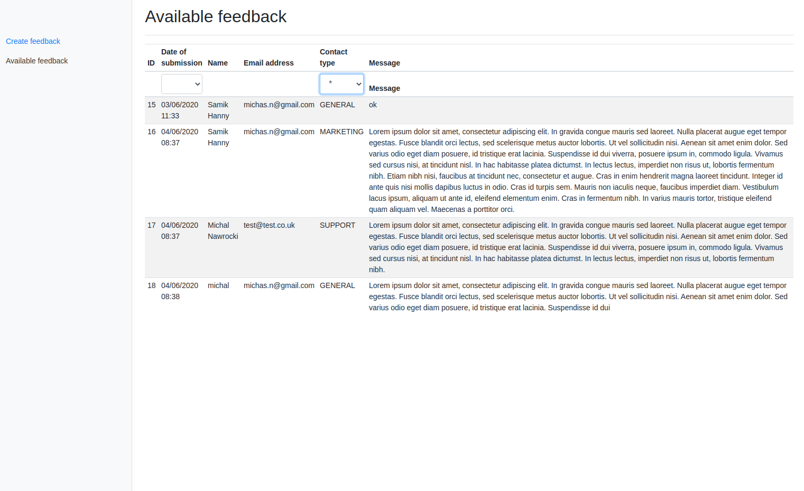

# Tools
I decided to use
- Spring boot 
- Thymeleaf and Bootstrap
- JPA and Mysql
- Spock for testing
- Checkstyle

### Database
 Use  docker compose to spin up database.
 In main directory execute
 `docker-compose run`
 Db configuration is located in `application.yml`
 
### Test coverage 
I have done good backend test coverage. Controller and service are covered.
 
### Improvement
It will be good to add more validation around email address and minimal string length.
Pagination need to be implemented in frontend. Backend is already supporting pagination. 

 
 ---
 
 ---
 
 ---
 
 ---
 
   
  
 
